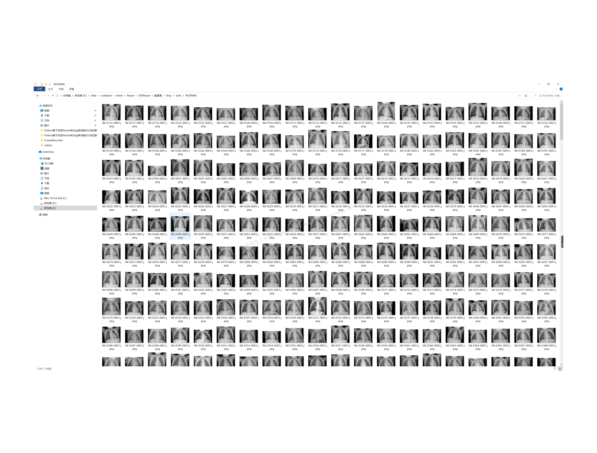

# 前言
基于卷积神经网络肺炎图片识别分类，图片为X光线肺部图，要求识别分类为三类“正常(NORMAL)、细菌性肺炎(BACTERIA)、病毒性肺炎（VIRUS）”，可以计算出分类情况的准确率，并且图片识别准确率至少达到80%以上，数据集分为“训练组、测试组、验证组”。

# 1.效果演示


# 2.视频演示
[[项目分享]Python基于改进Resnet和Vgg新冠肺炎图像分类[源码＆部署教程]_哔哩哔哩_bilibili](https://www.bilibili.com/video/BV1M14y1e7Se/?vd_source=bc9aec86d164b67a7004b996143742dc)


# 3.数据集的采集
### 正常(NORMAL)


### 细菌性肺炎(BACTERIA)


### 病毒性肺炎（VIRUS）


# 4.分类网络的构建
## （1）vgg模型
`AlexNet`问世之后，很多学者通过改进`AlexNet`的网络结构来提高自己的准确率，主要有两个方向：小[卷积核](https://so.csdn.net/so/search?q=%E5%8D%B7%E7%A7%AF%E6%A0%B8&spm=1001.2101.3001.7020)和多尺度。而`VGG`的作者们则选择了另外一个方向，即加深网络[深度](https://so.csdn.net/so/search?q=%E6%B7%B1%E5%BA%A6&spm=1001.2101.3001.7020)。
故而vgg模型是加深了网络深度的`AlexNet`模型
#### 那么什么是[AlexNet](https://so.csdn.net/so/search?q=AlexNet&spm=1001.2101.3001.7020)模型

网络总共的层数为8层，5层卷积，3层[全连接层](https://so.csdn.net/so/search?q=%E5%85%A8%E8%BF%9E%E6%8E%A5%E5%B1%82&spm=1001.2101.3001.7020)。
## （2）resnet模型
神经网络层数比较高时，就很难被训练，容易出现梯度爆炸、梯度消失等问题。残差网络就是一种跳跃连接的网络，它通过将前面的激活值跳过中间的网络层而直接传到更后面的网络中，来避免梯度爆炸和梯度消失，训练更深的网络。
一个神经网络在准确率已经达到饱和的情况下，增加网络层数可能会导致梯度爆炸和梯度消失的情况，导致准确率突然下降。
梯度爆炸：激活值会越来越大 ——欠拟合
残差块结构特点
前向计算时：先将卷积层的输入矩阵缓存在downsample函数中，然后与卷积层的输出层相加
[参考该博客，如何在vgg模型中加入resnet](https://mbd.pub/o/bread/Y5WYl59w)
### 步骤
先将卷积结构放入残差块中——注意如果输入个数！=输出个数，1*1卷积维度变换，将残差结构缓存在downsample私有函数中，前向计算函数输出out = f （卷积）+ identify（dewnsaple）
顺序写出vgg卷积结构，前向计算写完后时torch会自动调用块类中的forward函数
对ResNet的深层次理解
首先解答第一个问题，为什么深度神经网络会发生退化？

举个例子：假如某个神经网络的最优网络层数是18层，但是我们在设计的时候并不知道到底多少层是最优解，本着层数越深越好的理念，我们设计了32层，那么32层神经网络中有14层其实是多余地，我们要想达到18层神经网络的最优效果，必须保证这多出来的14层网络必须进行恒等映射，恒等映射的意思就是说，输入什么，输出就是什么，可以理解成F(x)=x这样的函数，因为只有进行了这样的恒等映射咱们才能保证这多出来的14层神经网络不会影响我们最优的效果。

梯度爆炸现象的一种解释
网络实际最优层数应该在设计层数之前，多了几层之后会出现随着参数不断优化（训练到超过最优层数），loss反而升高的现象
但现实是神经网络的参数都是训练出来地，要想保证训练出来地参数能够很精确的完成F(x)=x的恒等映射其实是很困难地。多余的层数较少还好，对效果不会有很大影响，但多余的层数一多，可能结果就不是很理想了。[参考该博客提出的残差神经网络来解决神经网络退化的问题](https://afdian.net/item?plan_id=f1859ffc617811edad5c52540025c377)。
### 为什么添加了残差块能防止神经网络退化问题呢？
咱们再来看看添加了残差块后，咱们之前说的要完成恒等映射的函数变成什么样子了。是不是就变成h(X)=F(X)+X，我们要让h(X)=X，那么是不是相当于只需要让F(X)=0就可以了，这里就巧妙了！神经网络通过训练变成0是比变成X容易很多地，因为大家都知道咱们一般初始化神经网络的参数的时候就是设置的[0,1]之间的随机数嘛。所以经过网络变换后很容易接近于0。举个例子：
假设该网络只经过线性变换，没有bias也没有激活函数。我们发现因为随机初始化权重一般偏向于0，那么经过该网络的输出值为[0.6 0.6]，很明显会更接近与[0 0]，而不是[2 1]，相比与学习h(x)=x，模型要更快到学习F(x)=0。
并且ReLU能够将负数激活为0，过滤了负数的线性变化，也能够更快的使得F(x)=0。这样当网络自己决定哪些网络层为冗余层时，使用ResNet的网络很大程度上解决了学习恒等映射的问题，用学习残差F(x)=0更新该冗余层的参数来代替学习h(x)=x更新冗余层的参数。
这样当网络自行决定了哪些层为冗余层后，通过学习残差F(x)=0来让该层网络恒等映射上一层的输入，使得有了这些冗余层的网络效果与没有这些冗余层的网络效果相同，这样很大程度上解决了网络的退化问题。

# 5.代码实现
```
class VGG16(nn.Module):
    def __init__(self):
        super(VGG16, self).__init__()
        self.features = nn.Sequential(
            # conv1
            nn.Conv2d(3, 64, 3, 1, 1),
            nn.BatchNorm2d(64, 0.9),
            nn.ReLU(),
            nn.Conv2d(64, 64, 3, 1, 1),
            nn.BatchNorm2d(64, 0.9),
            nn.ReLU(),
            nn.MaxPool2d(2, 2),
            # conv2
            nn.Conv2d(64, 128, 3, 1, 1),
            nn.BatchNorm2d(128, 0.9),
            nn.ReLU(),
            nn.Conv2d(128, 128, 3, 1, 1),
            nn.BatchNorm2d(128, 0.9),
            nn.ReLU(),
            nn.MaxPool2d(2, 2),
            # conv3
            nn.Conv2d(128, 256, 3, 1, 1),
            nn.BatchNorm2d(128, 0.9),
            nn.ReLU(),
            nn.Conv2d(256, 256, 3, 1, 1),
            nn.BatchNorm2d(256, 0.9),
            nn.ReLU(),
            nn.Conv2d(256, 256, 3, 1, 1),
            nn.BatchNorm2d(256, 0.9),
            nn.ReLU(),
            nn.MaxPool2d(2, 2),
            # conv4
            nn.Conv2d(256, 512, 3, 1, 1),
            nn.BatchNorm2d(512, 0.9),
            nn.ReLU(),
            nn.Conv2d(512, 512, 3, 1, 1),
            nn.BatchNorm2d(512, 0.9),
            nn.ReLU(),
            nn.Conv2d(512, 512, 3, 1, 1),
            nn.ReLU(),
            nn.MaxPool2d(2, 2),
            # conv5
            nn.Conv2d(512, 512, 3, 1, 1),
            nn.BatchNorm2d(512, 0.9),
            nn.ReLU(),
            nn.Conv2d(512, 512, 3, 1, 1),
            nn.BatchNorm2d(512, 0.9),
            nn.ReLU(),
            nn.Conv2d(512, 512, 3, 1, 1),
            nn.BatchNorm2d(512, 0.9),
            nn.ReLU(),
            nn.MaxPool2d(2, 2)
            )

        self.classifier = nn.Sequential(
            # fc1
            nn.Linear(512, 4096),
            nn.ReLU(),
            nn.Dropout(),
            # fc2
            nn.Linear(4096, 4096),
            nn.ReLU(),
            nn.Dropout(),
            # fc3
            nn.Linear(4096, 1000),
        )

    def forward(self, x):
        x = self.features(x)
        x = x.view(x.size(x), -1)
        x = self.classifier(x)
        return x

net=VGG16()
print(net)

```
第一层：卷积层1，输入为 224 × 224 × 3 224 \times 224 \times 3 224×224×3的图像，卷积核的数量为96，论文中两片GPU分别计算48个核; 卷积核的大小为 11 × 11 × 3 11 \times 11 \times 3 11×11×3; stride = 4, stride表示的是步长， pad = 0, 表示不扩充边缘;
卷积后的图形大小是怎样的呢？
wide = (224 + 2 * padding - kernel_size) / stride + 1 = 54
height = (224 + 2 * padding - kernel_size) / stride + 1 = 54
dimention = 96
然后进行 (Local Response Normalized), 后面跟着池化pool_size = (3, 3), stride = 2, pad = 0 最终获得第一层卷积的feature map
最终第一层卷积的输出为

第二层：卷积层2, 输入为上一层卷积的feature map， 卷积的个数为256个，论文中的两个GPU分别有128个卷积核。卷积核的大小为： 5 × 5 × 48 5 \times 5 \times 48 5×5×48; pad = 2, stride = 1; 然后做 LRN， 最后 max_pooling, pool_size = (3, 3), stride = 2;

第三层：卷积3, 输入为第二层的输出，卷积核个数为384, kernel_size = ( 3 × 3 × 256 3 \times 3 \times 256 3×3×256)， padding = 1, 第三层没有做LRN和Pool

第四层：卷积4, 输入为第三层的输出，卷积核个数为384, kernel_size = ( 3 × 3 3 \times 3 3×3), padding = 1, 和第三层一样，没有LRN和Pool

第五层：卷积5, 输入为第四层的输出，卷积核个数为256, kernel_size = ( 3 × 3 3 \times 3 3×3), padding = 1。然后直接进行max_pooling, pool_size = (3, 3), stride = 2;

第6,7,8层是全连接层，每一层的神经元的个数为4096，最终输出softmax为1000,因为上面介绍过，ImageNet这个比赛的分类个数为1000。全连接层中使用了RELU和Dropout。

```
class ResBlock(nn.Module):
    def __init__(self, input_channels, out_channels, kernel_size):
        super(ResBlock, self).__init__()

        self.function=nn.Sequential(
            nn.Conv2d(input_channels, out_channels, kernel_size, padding=1),
            nn.Conv2d(out_channels, out_channels, kernel_size, padding=1)
        )

        self.downsample=nn.Sequential(
            nn.Conv2d(input_channels,out_channels,kernel_size,padding=1)
        )

    def forward(self, x):
        identify = x
        identify=self.downsample(identify)

        f = self.function(x)
        out = f + identify
        return out
```
```
# 首先将vgg第一层卷积代码加入残差块结构
class My_Model_Blook(nn.Module):
    def __init__(self,input_channels, out_channels, kernel_size):  # 3 64 3
        super(My_Model_Blook, self).__init__()
        self.function = nn.Sequential(
            nn.Conv2d(input_channels, out_channels, kernel_size, 1, 1),
            nn.BatchNorm2d(out_channels, 0.9),
            nn.ReLU(),
            nn.Conv2d(out_channels, out_channels, kernel_size, 1, 1),
            nn.BatchNorm2d(out_channels, 0.9),
            nn.ReLU(),
            nn.MaxPool2d(2, 2)
        )

        self.downsample = nn.Sequential(
            nn.Conv2d(input_channels, out_channels, kernel_size, 1, 1),
            nn.BatchNorm2d(out_channels, 0.9),
            nn.ReLU(),
            nn.MaxPool2d(2, 2),
            # nn.Conv2d(out_channels, out_channels, kernel_size, 1, 1),
            # nn.BatchNorm2d(out_channels, 0.9),
            # nn.ReLU(),
            # nn.MaxPool2d(2, 2)
        )


    def forward(self, x):
        identify = x
        identify = self.downsample(identify)
        f = self.function(x)

        # print(f"f:{f.size()}  identify:{identify.size()}")

        out = f + identify
        return out

# 将残差块代码封装复用
class My_Model(nn.Module):
    def __init__(self,in_channels=3, num_classes=10):
        super(My_Model, self).__init__()
        self.conv1 = nn.Sequential(
            My_Model_Blook(3,64,3)
        )
        self.conv2 = nn.Sequential(
            My_Model_Blook(64, 128, 3)
        )
        self.conv3 = nn.Sequential(
            My_Model_Blook(128, 256, 3)
        )
        self.conv4 = nn.Sequential(
            My_Model_Blook(256, 512, 3)
        )
        
        # bug:输入输出一致时不能用1*1卷积，会发生维度消失，无法衔接后面模型
        # 解决方法：在残差块中不加1*1卷积或者单独卷积
        
        # self.conv5 = nn.Sequential(
        #     My_Model_Blook(512, 512, 3)
        # )


        self.classifier = nn.Sequential(
            # fc1
            nn.Linear(512, 1024),
            nn.ReLU(),
            nn.Dropout(),
            # fc2
            nn.Linear(1024, 1024),
            nn.ReLU(),
            nn.Dropout(),
            # fc3
            nn.Linear(1024, num_classes),
        )
    def forward(self, x):
        out = self.conv1(x)
        out = self.conv2(out)
        out = self.conv3(out)
        out = self.conv4(out)
        
        # bug:输入输出一致时不能用1*1卷积，会发生维度消失，无法衔接后面模型
        
        # print(out.size())
        # out = self.conv5(out)
        # print(out.size())
        # out = out.resize(512,1,1)

        out = out.view((x.shape[0], -1))  # 拉成一维
        out = self.classifier(out)
        return out
```
# 6.系统整合
下图[源码＆脚本＆部署教程＆数据集](https://s.xiaocichang.com/s/345d97)


参考博客[《Python基于改进Vgg＆Resnet新冠肺炎分类\[源码＆部署教程\]》](https://mbd.pub/o/qunma/work)

# 7.参考文献

[1] S. Madhogaria et al., Pixel-based classifification method for detecting 	unhealthy regions in leaf images, GI-Jahrestagung. (2011). 
[2] A.l. Bashish, M.B. Dheeb, S. Bani-Ahmad, A framework for detection and 
classifification of plant leaf and stem diseases, 2010 International Conference 	on Signal and Imageprocessing, IEEE, 2010. 
[3] P. Revathi, M. Hemalatha, Advance computing enrichment evaluation of cotton 	leaf spot disease detection using image edge detection, 2012 Third 
International Conference on Computing, Communication and Networking 
Technologies (ICCCNT’12), IEEE, 2012. 
[4] P.S. Landge et al., Automatic detection and classifification of plant 	disease through image processing, Int. J. Adv. Res. Comp. Sci. Softw. Eng. 3 	(7) (2013) 798–801. 
[5] M. Ranjan et al., Detection and classifification of leaf disease using 	artifificial neural network, Int. J. Techn. Res. Appl. 3 (3) (2015) 331–333. 
[6] B.S. Prajapati, V.K. Dabhi, H.B. Prajapati, A survey on detection and 
classifification of cotton leaf diseases, 2016 International Conference on 
Electrical, Electronics, and Optimization Techniques (ICEEOT), IEEE, 2016.
[7] A. Khamparia, G. Saini, D. Gupta, A. Khanna, S. Tiwari, V.H.C. de Albuquerque, 	Seasonal crops disease prediction and classifification using deep convolutional 	encoder network, Circ. Syst. Sign. Process. 39 (2) (2020) 818–836. 
[8] S.P. Mohanty, D.P. Hughes, M. Salathé, Using deep learning for image-based 	plant disease detection, Front. Plant Sci. 7 (2016) 1419. 
[9] P. Gong, C. Zhang, M. Chen, Deep learning for toxicity and disease prediction, 	Front. Genet. 11 (2020) 175. 


---
#### 如果您需要更详细的【源码和环境部署教程】，除了通过【系统整合】小节的链接获取之外，还可以通过邮箱以下途径获取:
#### 1.请先在GitHub上为该项目点赞（Star），编辑一封邮件，附上点赞的截图、项目的中文描述概述（About）以及您的用途需求，发送到我们的邮箱
#### sharecode@yeah.net
#### 2.我们收到邮件后会定期根据邮件的接收顺序将【完整源码和环境部署教程】发送到您的邮箱。
#### 【免责声明】本文来源于用户投稿，如果侵犯任何第三方的合法权益，可通过邮箱联系删除。